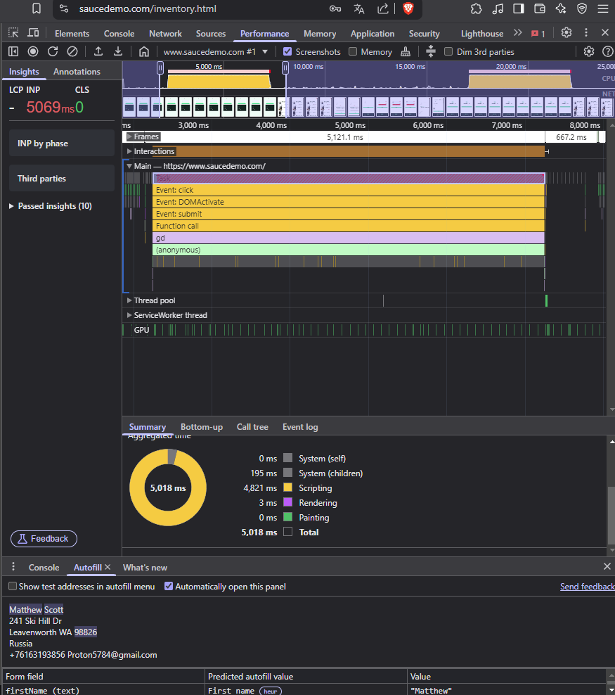

## Баг #1: Медленная загрузка главной страницы после авторизации

**Серьезность**: Major  
**Приоритет**: High  
**Окружение**: Chrome 120, Windows 11  

### Шаги воспроизведения:
1. Введите логин `performance_glitch_user`, пароль `secret_sauce`.
2. Нажмите Login.
3. Дождитесь загрузки главной страницы.

### Ожидаемый результат:
Переход на главную страницу за <100 мс.

### Фактический результат:
Задержка загрузки — **5121 мс**.

### Доказательства:
- **Лог производительности (DevTools)**:  
  
- **Снимок вкладки Performance**:  
  
- **Long Tasks**:  
  - Задача 1: 4821 мс (Scripting).  
  - Задача 2: 3 мс (Rendering).  

### Рекомендации:
- Проверить оптимизацию сетевых запросов.