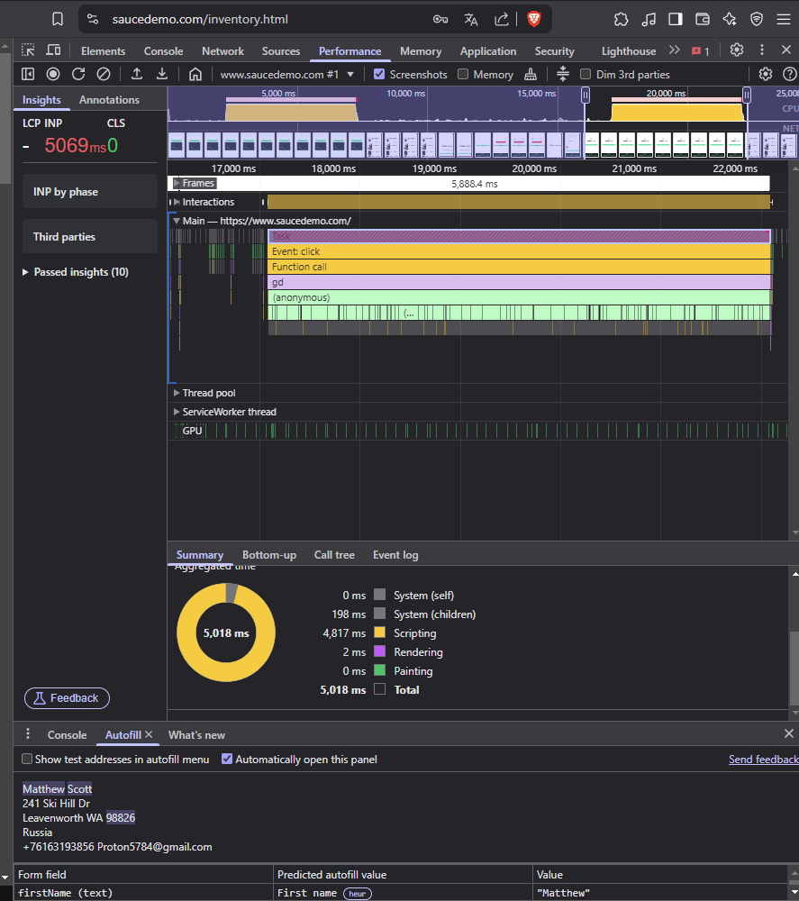

## Баг #2: Медленный переход на главную страницу после оформления заказа

**Серьезность**: Major  
**Приоритет**: High  
**Окружение**: Chrome 120, Windows 11  

### Шаги:
1. Оформите заказ как `performance_glitch_user`.
2. Нажмите "Back Home".

### Ожидаемый результат:
Переход на главную страницу за <100 мс.

### Фактический результат:
Задержка — **5888 мс**.

### Доказательства:
- **Лог производительности (DevTools)**:  
  
- **Снимок вкладки Performance**:  
  
- **Long Tasks**:  
  - Задача 1: 4817 мс (Scripting).  
  - Задача 2: 2 мс (Rendering).  

### Рекомендации:
- Проверить оптимизацию сетевых запросов.