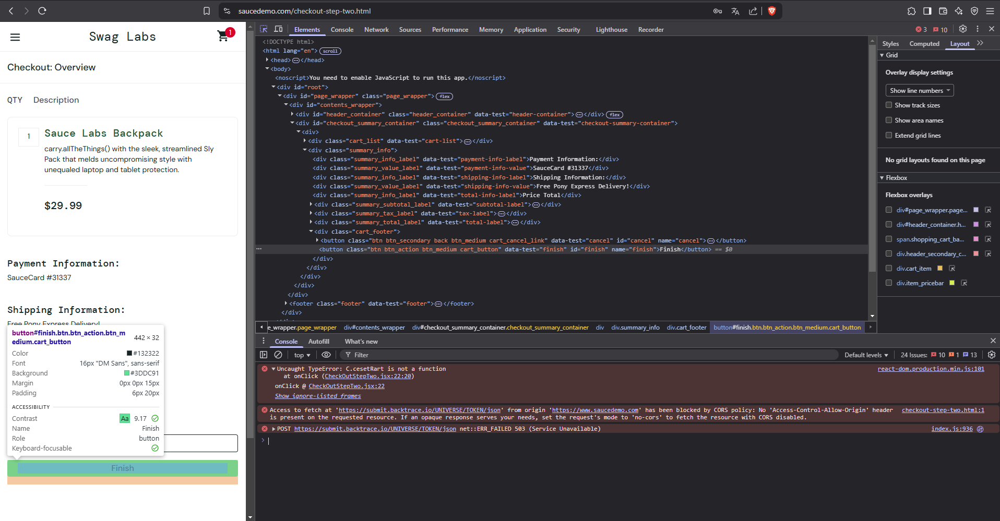
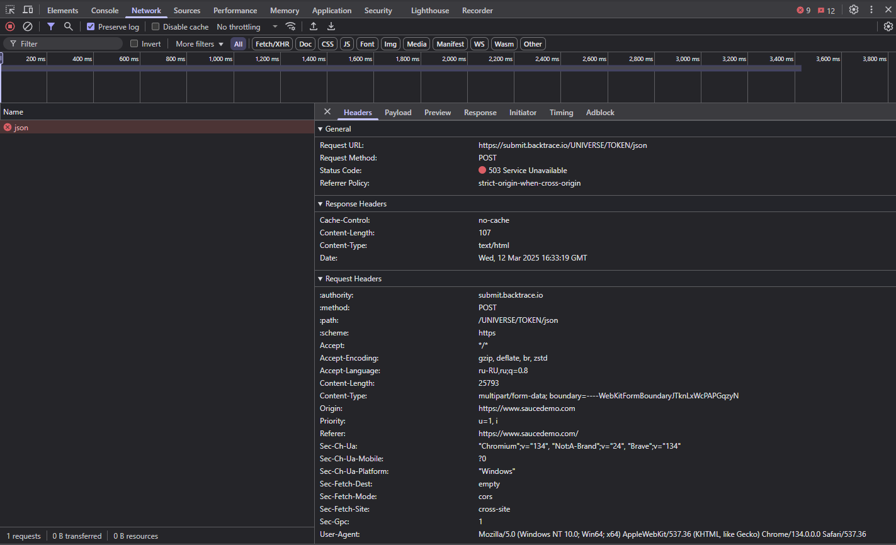

## Баг #1: Кнопка Finish не работает для пользователя error_user

**Серьезность**: Critical  
**Приоритет**: High  
**Окружение**: Chrome 120, Windows 11  

### Шаги воспроизведения:
1. Залогиньтесь как `error_user`.
2. Добавьте товар в корзину.
3. Перейдите в корзину → нажмите **Checkout**.
4. Заполните форму:
   - **First Name**: John.
   - **Last Name**: Doe.
   - **Postal Code**: 12345.
5. Нажмите **Continue**.
6. Попробуйте нажать **Finish**.

### Ожидаемый результат:
- Кнопка **Finish** активна.
- После нажатия появляется сообщение "Thank you for your order!".

### Фактический результат:
- Кнопка **Finish** не работает (неактивна или не реагирует на клик).

### Доказательства:
- **Скриншот формы**:  
  
- **Скриншот Console**:  
  
- **Скриншот Network**:  
  

### Анализ ошибок:
1. **Ошибка JavaScript**: В консоли обнаружена ошибка `Uncaught TypeError: C.cesetRart is not a function`.
2. **Ошибка CORS**: Запрос к стороннему ресурсу заблокирован из-за политики CORS.
3. **Ошибка 503**: Сервер недоступен.

### Рекомендации:
1. Проверить код, связанный с кнопкой **Finish**.