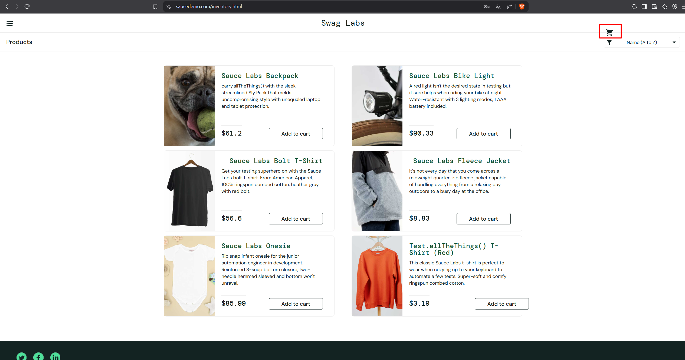
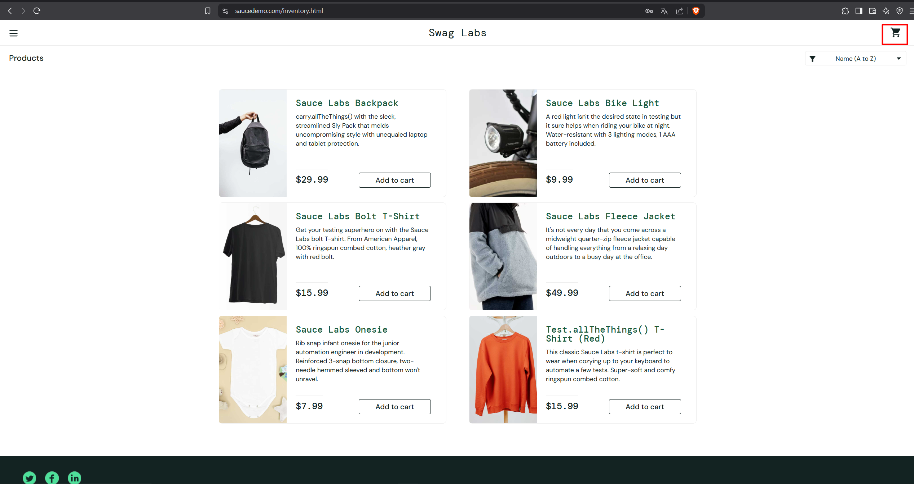

## Баг #1: Смещение иконки корзины

**Серьезность:** Medium  
**Приоритет:** High  
**Окружение:** Chrome 120, Windows 11  

### Шаги воспроизведения:
1. Залогиньтесь как `visual_user`.
2. Перейдите на страницу товаров (`/inventory.html`).

### Ожидаемый результат:
Иконка корзины расположена в правом верхнем углу, размеры 40x40px (как у `standard_user`).

### Фактический результат:
Иконка корзины смещена вниз/влево, размеры 30.4x40px.

### Доказательства:
1. **Скриншоты интерфейса:**
   - Иконка корзины у `visual_user`:  
     
   - Иконка корзины у `standard_user`:  
     

2. **Фрагменты кода:**
   - У `visual_user` для иконки задано `position: absolute` с `top: 0px; left: 0px`, но родительский контейнер не имеет `position: relative`, что приводит к неправильному позиционированию.
   - У `standard_user` используется `position: relative`.

### Анализ ошибок:
1. **Неправильное позиционирование:** У `visual_user` иконка корзины использует `position: absolute`, но родительский контейнер не имеет `position: relative`, что приводит к смещению.
2. **Размеры иконки:** Высота иконки у `visual_user` — 30.4px, а у `standard_user` — 40px.

### Рекомендации:
1. Удалить `position: absolute` для иконки корзины.
2. Добавить `position: relative` родительскому контейнеру.
3. Выровнять размеры иконки (40x40px).