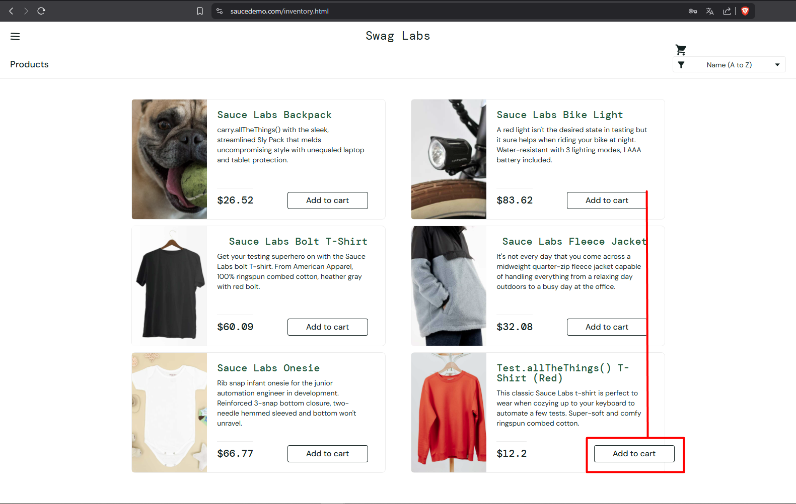
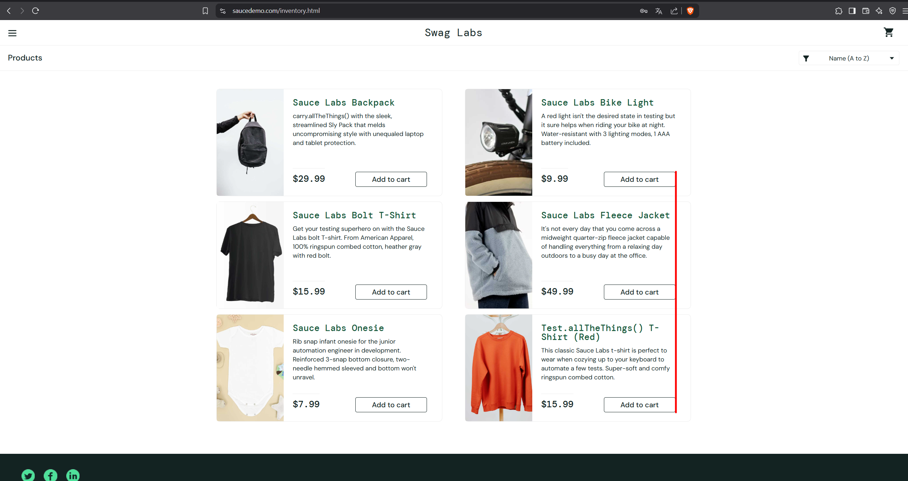

## Баг #2: Смещение кнопки "Add to cart" для нижнего правого товара

**Серьезность:** Medium  
**Приоритет:** High  
**Окружение:** Chrome 120, Windows 11  

### Шаги воспроизведения:
1. Залогиньтесь как `visual_user`.
2. Перейдите на страницу товаров (`/inventory.html`).
3. Найдите товар в нижнем правом углу страницы.
4. Проверьте положение кнопки "Add to cart" для этого товара.

### Ожидаемый результат:
Кнопка "Add to cart" расположена по центру карточки товара.

### Фактический результат:
Кнопка смещена вправо, частично выходит за границы карточки товара.

### Доказательства:
1. **Скриншоты интерфейса:**
   - Кнопка "Add to cart" у `visual_user`:  
     
   - Кнопка "Add to cart" у `standard_user`:  
     

2. **Фрагменты кода:**
   - У `visual_user` задано `position: absolute` с `right: -20px`, что смещает кнопку за пределы контейнера.
   - У `standard_user` кнопка находится в нормальном потоке.

### Анализ ошибок:
1. **Неправильное позиционирование:** У `visual_user` кнопка использует `position: absolute` с `right: -20px`, что приводит к смещению.
2. **Выход за границы:** Кнопка частично выходит за пределы карточки товара.
3. **Проблема только для нижнего правого товара:** Ошибка проявляется только для товара, расположенного в нижнем правом углу страницы.

### Рекомендации:
1. Удалить `position: absolute` и `right: -20px`.