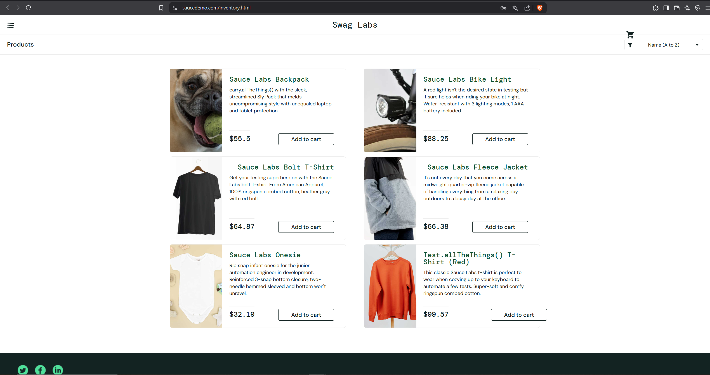

# Баг #3: Фильтрация по цене генерирует случайные значения

**Серьезность:** Critical  
**Приоритет:** Highest  
**Окружение:** Chrome 120, Windows 11  

### Шаги воспроизведения:
1. Залогиньтесь как `visual_user`.
2. Перейдите на страницу товаров (`/inventory.html`).
3. Выберите фильтр любой фильтр.
4. Повторите выбор фильтра 4 раза.

### Ожидаемый результат:
Товары каждый раз сортируются в соответствии с функцией фильтра.

### Фактический результат:
Порядок товаров и их цены меняются случайным образом.

### Доказательства:
1. **Скриншоты интерфейса:**
   - До фильтрации:  
     
   - После фильтрации:  
     

2. **Фрагменты кода:**
   - Генерация случайных цен:
     ```javascript
     const randomPrice = () => Math.round(Math.random() * 10000) / 100;
     price={isVisualFailure ? randomPrice() : item.price}
     ```
   - Сортировка товаров:
     ```javascript
     setInventoryList(sortHiLo(InventoryData, "price"));
     ```

3. **Сравнение с `standard_user`:**
   - У `standard_user` фильтрация работает корректно

### Анализ ошибок:
1. **Случайные цены:** Для `visual_user` цена каждого товара генерируется случайным образом с помощью функции `randomPrice`.
2. **Фильтрация на клиенте:** Сортировка выполняется локально, но из-за случайных цен результат непредсказуем.

### Рекомендации:
1. Убрать вызов `randomPrice` для `visual_user` и использовать реальные цены из `item.price`.
2. Проверить функции сортировки (`sortAsc`, `sortDesc`, `sortHiLo`, `sortLoHi`) на наличие ошибок.