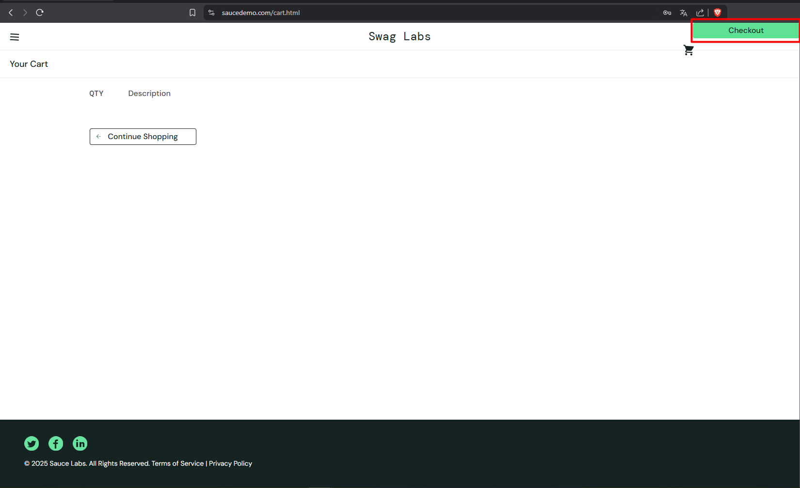
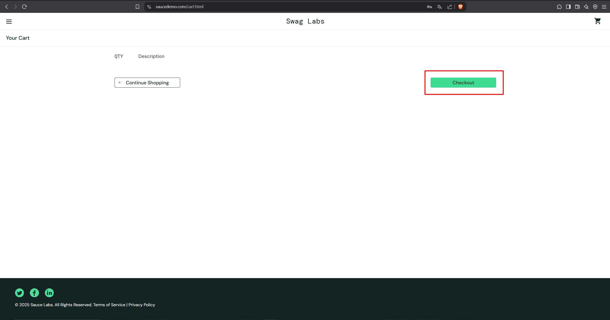

## Баг #4: Кнопка "Checkout" смещена в правый верхний угол

**Серьезность:** High  
**Приоритет:** Highest  
**Окружение:** Chrome 120, Windows 11  

### Шаги воспроизведения:
1. Залогиньтесь как `visual_user`.
2. Добавьте товар в корзину.
3. Перейдите в корзину (`/cart.html`).

### Ожидаемый результат:
Кнопка "Checkout" расположена как у `standard_user`, размеры 220x34px.

### Фактический результат:
Кнопка прижата к правому верхнему углу, размеры 539.2x32px.

### Доказательства:
1. **Скриншоты интерфейса:**
   - Кнопка "Checkout" у `visual_user`:  
     
   - Кнопка "Checkout" у `standard_user`:  
     

2. **Фрагменты кода:**
   - У `visual_user` задано `position: absolute` с `right: 0px; top: 0px`, что прижимает кнопку к углу.
   - У `standard_user` кнопка находится в нормальном потоке.

### Анализ ошибок:
1. **Неправильное позиционирование:** У `visual_user` кнопка использует `position: absolute` с `right: 0px; top: 0px`, что прижимает её к правому верхнему углу.
2. **Неправильные размеры:** Ширина кнопки у `visual_user` — 539.2px, а у `standard_user` — 220px.

### Рекомендации:
1. Удалить `position: absolute`, `right: 0px`, `top: 0px`.
2. Использовать стандартное позиционирование и выравнивание через CSS.
3. Выровнять размеры кнопки (220x34px).